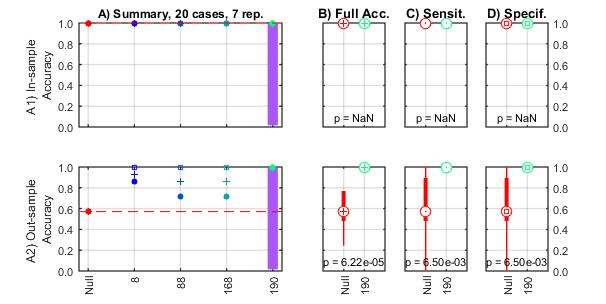

# basic_SVM Matlab code #

This page is a quick manual to the use of the function basic_SVM (basic Support Vector Machine). This code is located in {{{https://github.com/DCAN-Labs/MachineLearning_SVM/}}}

basic_SVM is a set of functions to run machine learning to make classification. It needs as input a set of features and the corresponding class. At this moment it is only able to handle dichotomous cases (eg, 1 and 0, siblings and unrelated, control and adhd, ...). 

The program explore the use of different features and reports the performance (in- and out-of-sample) on each case. For example, if your data has 100 features, this program can help you to explore the performance of using 10, 20, ... 100 features in classification (You can easily define how many and how much features to include).

For each feature set, the program splits the data into two partitions (one partition for training and another for testing), optimizes a classifier in the partition testing and uses it in the fresh data reserved for testing (partition testing). This is repeated N times and results are reported. 

## How does it work ##

In detail, on each run n of N total runs, the data (features and their corresponding class: 1 or 0; sibling or unrelated) is partitioned into 2 samples: "training" and "test", where the partition "training" is left with m elements. The classifier is optimized by default using leave-one-out cross validation (loocv) on this partition “training” (You can use leave 5, leave 10, or any other validation schema). To run the optimization, the partition "training" is split into m subpartitions. Each subpartition has m-1 elements for training and 1 element for testing, hence each element is used once for testing (hence, loocv). The optimization starts by setting the parameters to be optimized at random values. Next, those parameters are used to calculate the out-of-sample prediction error in the element that was left out for validation, and the procedure is repeated for each subpartition on the corresponding run n. Then, the average classification error is calculated. Next, the parameters are modified in the direction that minimizes the out of sample error. This procedure is repeated until the out-of-sample error can no longer be reduced. Once the optimization finishes for each run n, the final (optimal) parameters are used to train a classifier using the entire partition "training". The resulting (“optimized”) classifier is tested on the fresh partition "test" and the classification error is reported. This procedure is repeated N times and the average accuracy is reported. 

'''Feature selection.''' Once the number of features are defined, on each run ''n'' out of ''N'', each features is compared between groups using the '''Kolmogorov-Smirnov''' distance, which is based on the maximum distance between cumulative distributions. We decided to use the Kolmogorov-Smirnov test because it makes no assumptions on the corresponding subjacent probability distribution functions of the features (Loudin & Miettinen, 2003)  . . 

## How do I use it ##

Here, an example will be used to illustrate it's use and the way to define options.

### Example ###

First thing to do is to add the path of the code to your Matlab session:

``` matlab
addpath(genpath('/group_shares/PSYCH/code/development/utilities/MachineLearning'));
```

Let's start with an example. Lets assume you have a data set with 200 features and 20 cases. You need to provide the feature set. Lets call it matrix X.  X's size is expected to be cases times features. You also need to provide a vector with the classes for each case. This vector can only have 2 values: 1's and 0's, for example. y's size is expected to be cases times 1. Now, let's make fake data:

``` matlab
%% Make fake data
n_cases=20;% define the number of participant, of cases
n_feat=200;% define the number of features

X1=randn(n_cases/2,n_feat); % Fake features for half cases
X2=10+randn(n_cases/2,n_feat); % Fake distinct features for second half of cases
X=[X1; X2];


y=(1:n_cases)'>n_cases/2;% Assign classes (This will make a vector of 1's and 0's)

```

Here, in line 5 we are faking the features for the first class (normally distributes numbers). Line 6 fake data for the second class (also normally distributes numbers but with an offset of 10). Line 10 make the classes, where the first half are 0's and the second half are ones. 

If you run the program just using X and y without any extra option

``` matlab
[DATA, NULL]=basic_SVM(X,y);
```

the program run using the default settings:
```
options = 

                     N: 1000 | Each partition will be made N times

         perc_training: 80   | Each feature set will be partitioned using 80% of the data for training

         core_features: 20   | It will use 10% of the total features as the first feature set to explore

    increment_features: 20   | Each feature set will be increased by adding 10% of the available features

         upto_features: 200  | The analysis will be repeated until including all the available features

             partition: 'LeaveOut' | For each individual run, the partition training will be used to optimize the parameters of a classifier by loocv. Once having the optimized parameters, the entire partition training will be used to calculate the classifier. Resulting classifier will be used in the fresh data. 

             N_opt_svm: 1    | Advanced feature, indicates how many times to repeat the validation on SVM (more is better, at the expense of time)

       null_hypothesis: 'best'   | Calculate the null hypothesis just for the feature set with the best out-of-sample performance
```

You can use a combination of default options and required options. For example this code

``` matlab
options.N=7;
options.core_features=8;
options.increment_features=80;
options.upto_features=190;
[DATA, NULL]=basic_SVM(X,y,options)
```

Indicates each feature set will be trained 7 times. The analysis will start using 8 core features, and the features will be increased by 80 until reaching 190.

Once done, the results will be presented graphically (Results are also saved in the structures DATA and NULL). You'll see a figure similar to this one:


